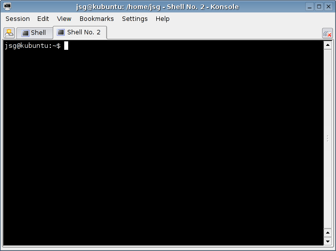
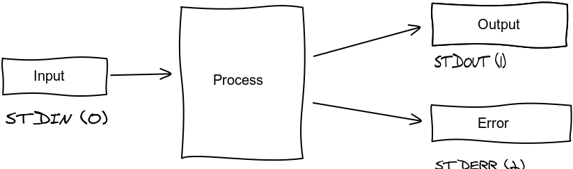
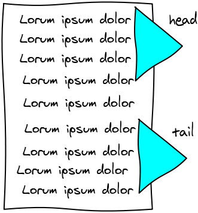
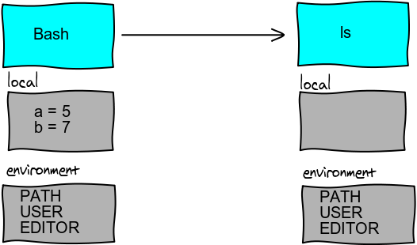

# Advanced Unix & Bash

Slides By: [Ynon Perek](http://ynonperek.com).


## About The Course 

My Email: 
[ynon@ynonperek.com](mailto:ynon@ynonperek.com)

Slides At: 
[ynonperek.com](http://ynonperek.com/static/unix2/)

Labs At:
[Unix 2
Labs](https://github.com/ynonp/unix2-bash-scripts-slides/blob/master/labs/unix_scripting_lab.md)

Solutions and Demos:
[Unix 2 Demos](https://github.com/ynonp/unix2-bash-scripts-slides/tree/master/labs)


# Agenda

* Introduction To Shells
* Bash Basics
* Bash Scripts
* Regular Expressions
* Sed
* Awk


# This Is Your Shell



## Available Shells

* ash
* bsh, bash
* csh, tcsh
* dash
* ksh
* zsh
* And More...


## We'll Use Bash <span style="color:#6172f6;font-style:italic">(for automation)</span>

* <span class="fragment">It's the linux standard</span>
* <span class="fragment">It has rich syntax, AND functions</span>
* <span class="fragment">Powerful IO redirects</span>
* <span class="fragment">Built-in file tests</span>
* <span class="fragment">Built-in arithmetics</span>
* <span class="fragment">Built-in regular expressions</span>


## The People Behind Bash


Originally written by Brian Fox.   
Currently maintained by Chet Ramey.


## Bash Basics

<pre><code class="bash">
  # Print current shell
  echo $0

  # Print bash version
  echo $BASH_VERSION

  # Print where you are
  pwd

  # Read about bash
  man bash
</code></pre>


## What's In A Prompt

* hostname, path, username
* ~ means your home directory
* $ indicates a normal user (not root)

<pre><code class="bash">
  localhost:~ ynonperek$ 

</code></pre>


## Quoting: Rule-of-thumb

* Use single quote when you need to prevent shell interpolation
* Use double quotes when interpolation is required

<pre><code class="bash">
  # prints Show me the 99634$
  $ echo Show me the $$$

  # prints Show me the $$$
  $ echo 'Show me the $$$'

  # prints You're running -bash
  $ echo "You're running $0"

</code></pre>


# Q & A 


# Shell Basics
* Wildcards
* Pipes & Filters
* Environment and System Files
* Find
* Background Execution


## Wildcard Substitution

* If a word _has a_ wildcard, bash will replace that word with a list
of matching filenames
* Assume files a.txt, b.txt and c.txt are in the current folder
<pre><code class="bash">
  # * is a wildcard
  # so *.txt turns to a.txt b.txt c.txt
  $ rm *.txt

  # The same as writing
  $ rm a.txt b.txt c.txt
</code></pre>


## Wildcard Substitution
<table border="1" cellpadding="5" cellspacing="0" class="tuxtable">
  <tbody>
    <tr>
      <td class="tuxtitle"><em>Wildcard</em></td>
      <td class="tuxtitle"><em>Matches</em></td>
    </tr>
    <tr>
      <td class="tuxtext">*</td>
      <td class="tuxtext">zero or more characters</td>
    </tr>
    <tr>
      <td class="tuxtext">?</td>
      <td class="tuxtext">exactly one character</td>
    </tr>
    <tr>
      <td class="tuxtext">[abcde]</td>
      <td class="tuxtext">exactly one character listed</td>
    </tr>
    <tr>
      <td class="tuxtext">[a-e]</td>
      <td class="tuxtext">exactly one character in the given range</td>
    </tr>
    <tr>
      <td class="tuxtext">[!abcde]</td>
      <td class="tuxtext">any character that is not listed</td>
    </tr>
    <tr>
      <td class="tuxtext">[!a-e]</td>
      <td class="tuxtext">any character that is not in the given range</td>
    </tr>
    <tr>
      <td class="tuxtext">{debian,linux}</td>
      <td class="tuxtext">exactly one entire word in the options given</td>
    </tr>
  </tbody>
</table>


## Wildcards Demo
<pre><code class="bash">
  $ ls
  a.txt b.txt c.pl foobar buttercup Test File

  $ echo *.txt
  <span class="fragment">a.txt b.txt</span>

  <span class="fragment">$ echo [A-Z]*</span>
  <span class="fragment">Test File</span>
  <span class="fragment">$ ls *f*</span>
  <span class="fragment">foobar</span>

  <span class="fragment">$ ls .[!.]*</span>
</code></pre>


## More Wildcards
<pre><code class="bash">
  $ mv *linux*.html dir1

  $ less d*.txt

  $ ls {hd,sd}[a-c]

  $ cp [A-Z]* dir2

</code></pre>


## Command Substitution
* Beside wildcards, bash performs some more automatic substitutions
* Command substitutions are triggered with $(...)
* The expression inside parens is executed
* Bash substitutes the entire expression with its result


## Command Substitution
<pre><code class="bash">
  $ printf "0x%x\n" $(date +%Y)

  $ rm $(cat todelete.txt)
</code></pre>


<div class="slide-img">
  <h1>Q &amp; A</h1>
  
  <ul>
    <li class="done">Wildcards</li>
    <li>Pipes &amp; Filters</li>
    <li>Environment and System Files</li>
    <li>Find</li>
    <li>Background Execution</li>
  </ul>
</div>


## File Descriptors



* Each process has 3 file descriptors opened by default
* Bash opens STDIN for keyboard input
* And STDOUT, STDERR to screen output
* We can change these


## Redirecting Output

<pre><code class="bash">
  # prints to screen
  $ cowsay Hello

  # prints to file
  $ cowsay Hello > cow.art

  # append to file
  $ cowsay Hello >> cow.art
</code></pre>


## Redirecting Errors

<pre><code class="bash">
  $ touch main.c
  $ ls main.c nosuchfile.txt
  ls: nosuchfile.txt: No such file or directory
  main.c

  $ ls main.c nosuchfile.txt > filelist
  ls: nosuchfile.txt: No such file or directory
  
</code></pre>

* Errors are printed to STDERR (screen by default)
* Redirecting STDOUT has no effect


## Redirecting Errors
<pre><code class="bash">
  # sends both STDOUT and STDERR to file
  $ ls main.c nosuchfile.txt &> alloutput

  # send only STDERR to file
  $ ls main.c nosuchfile.txt 2> onlyerr

  # separate STDERR and STDOUT
  $ ls main.c nosuchfile.txt > filelist 2>err
</code></pre>


## Clobbering
* Redirecting output to a file `clobbers` its content
* We can tell bash not to allow clobbering

<pre><code class="bash">
  $ touch testfile
  
  $ ls > testfile

  $ set -o noclobber

  $ ls > testfile
  -bash: testfile: cannot overwrite existing file
</code></pre>


## Clobbering
* Tell bash to start clobbering again with `+o`
<pre><code class="bash">
  $ set +o noclobber

  $ ls > testfile
  $ ls > testfile
  $ ls > testfile

</code></pre>


## Clobbering

Even in noclobber mode, it's possible to clobber a specific file
<pre><code class="bash">
  $ ls > testfile
  -bash: testfile: cannot overwrite existing file

  # this one works
  $ ls >| testfile 
</code></pre>


## Pipes: Building longer chains


```
     _____ 
    <  40 >
     ----- 
            \   ^__^
             \  (oo)\_______
                (__)\       )\/\
                    ||----w |
                    ||     ||

```


## Connecting Multiple Programs
* Pipes allow connecting two or more programs
* Connect the output of one program _as the_ input of the other
* No need to invent a temporary filename, remember it and delete it
* Programs run in separate subshells


## Pipes Demo

<pre><code class="bash">
  $ cat one.txt two.txt | sort
  
  $ ls | wc -l | cowsay

  $ date | cowsay
</code></pre>


## Programs Using Pipes
* Many Unix programs can take input from pipes. Here's a partial list:
  * head, tail, tee
  * cut, tr
  * sort, uniq
  * wc, cowsay, grep
  * awk, sed 


## Saving a Copy of the Data

<span class="framed">Use a T-joint in the pipes (or in Unix, the `tee`
command)</span>

<pre><code class="bash">
  $ ls | tee list | wc -l

  $ cat file1.txt file2.txt | tee files | wc -l

  $ ls | tee list | grep txt | wc -l
</code></pre>


## Saving a Copy of the Data

* tee takes a file name and saves its input to the file
* It also passes its input forward to STDOUT
* Data is thus duplicated
* Optional parameters:
  * -a appends output to file


## Off with her head (or tail)

* Use head to cut just the top of the output
* Use tail to cut just the bottom of the output




## Using head

<pre><code class="bash" style="font-size:1em">
  $ ls -l | head -4

  total 834504
  -rw-r--r--     1 ynonperek  staff       1349 Dec 10 08:27 1
  -rw-r--r--     1 ynonperek  staff       1348 Dec 10 08:27 2
  drwxr-xr-x     3 ynonperek  staff        102 Sep 24 16:13 Apps
  
</code></pre>


## Using head
* Use either:
  * `head <filename>` or
  * `command | head`
* Pass [-n count] or [-count] for line count
* Pass [-c bytes] for byte count


## Using tail

<pre><code class="bash">
  $ cowsay hello | tail -4

            (__)\       )\/\
                ||----w |
                ||     ||
  
</code></pre>


## Using tail
* Use either:
  * `tail <filename>` or
  * `command | tail`
* Pass [-n count] or [-count] for line count
* Pass [-c count] for block count


## More tail options
* Use `tail -f` to track file changes
* Use `tail -r` to show input in reverse order
<pre><code class="bash"> $ cowsay Hello | tail -r

                    ||     ||
                    ||----w |
                (__)\       )\/\
             \  (oo)\_______
            \   ^__^
     ------- 
    < hello >
     _______ 
</code></pre>


## Cutting Data Based On Columns 

<pre><code class="bash">
  $ who
    ynonperek console  Feb 22 10:50 
    ynonperek ttys000  Mar  1 17:33 
    ynonperek ttys001  Mar  2 21:59 
    ynonperek ttys002  Mar  2 22:01 

  <span class="fragment"> $ who | cut -f2 -d' '
    console
    ttys000
    ttys001
    ttys002</span>
  
</code></pre>


## Cutting Data Based On Columns
* use `cut -f 2 -d ' '` to cut columns
* `-f` specifies field number
* `-d` specifies delimeter
* use `cut -c1-4,8` to cut characters
* pass `-s` to skip lines with no delim


## Translating characters
* Use `tr` to convert from one character set to another. 
* `tr` takes origin and destination character sets (each surrounded by single quote)
* Takes an optional input file.


## Using tr
<pre><code class="bash">
  $ tr 'a-z' 'A-Z' story.txt

  $ tr '0-9' '.' phones.txt

  $ tr 'a-zA-Z' 'A-Za-z' story.txt

  $ tr -d '0-9'

  $ tr -s ' '

</code></pre>


## Sorting Text
* Use `sort` to sort your output
* Takes input files and sort options
* By default sort ascending as text
* Use `sort -n` for numeric sort
* Use `sort -f` to ignore case


## Sorting Text
* Use `sort -k2` to sort using the second column
* Pass `-t` to use a custom separator
* Pass `-u` to print only unique values


## Saving Output
<pre><code class="bash">
  # Don't do this (won't work):
  $ sort data > data

  # Remember the -o (this works):
  $ sort data -o data
</code></pre>


## Grepping Output
* Use `grep` to filter out lines from output
* Pass `-v` to inverse
* Pass '-x' for full-line matches
* Use '-ilR' for recursive find-in-files


<div class="slide-img">
  <h1>Q &amp; A</h1>
  
  <ul>
    <li class="done">Wildcards</li>
    <li class="done">Pipes &amp; Filters</li>
    <li>Environment and System Files</li>
    <li>Find</li>
    <li>Background Execution</li>
  </ul>
</div>


## Improving The Environment


* Aliases
* Functions
* Special Env Variables


## Aliases
* An alias is a command shortcut
* Define an alias with `alias a='command'`
* Don't forget to quote
* Use `unalias` to remove an alias


## Useful Aliases
<pre><code class="bash">
  $ alias c=clear
  
  $ alias ll='ls -l'

  $ alias cd..='cd ..'
 
  $ alias ip='ifconfig |grep -w inet| tr -d "\t" | cut -d' ' -f2 | grep -v 127.0.0.1'
</code></pre>


## Alias Tricks
<pre><code class="bash">
  # Fool your friends
  $ alias ls='echo ALL YOUR BASE ARE BELONG TO US'

  # Try to run
  $ ls
  ALL YOUR BASE ARE BELONG TO US

  # Run original ls
  $ \ls
  $ 'ls'
</code></pre>


## Functions
<pre><code class="bash">
  $ fp main
 
  main.c main.o mainlyunix.txt 
</code></pre>
* Sometimes we want to pass parameters to our aliases
* In bash, we can use _functions_
* A function works _like_ an alias, but can take arguments


## Defining Functions
<pre><code class="bash">
  $ function add() { expr $1 + $2; }

</code></pre>
* Use the keyword `function` to define a function
* Inside the function, use $1 to access first argument
* $2, $3, ... also work
* Remember the semi-colon at the end


## Environment Variables
* Bash has two types of variables:
  * normal variables
  * environment variables
* Environment variables pass to child processes


## Environment Variables



## Special Environment Variables

<table>
  <tr>
    <th>Variable Name</th>
    <th>Meaning</th>
  </tr>
  <tr>
    <td>PATH</td>
    <td>Search path for executables</td>
  </tr>
  <tr>
    <td>USER</td>
    <td>Current user</td>
  </tr>
  <tr>
    <td>HOME</td>
    <td>Home directory</td>
  </tr>
  <tr>
    <td>PS1</td>
    <td>Primary prompt string</td>
  </tr>
  <tr>
    <td>EDITOR</td>
    <td>favorite text editor</td>
  </tr>
</table>


## Startup Files
* By default, changes to environment do not persist
* Bash reads special initialization files on startup
* Use startup files to create permanent changes to your environment
* Bash has 4 startup files


## Startup Files
<table>
  <tr>
    <th>File Name</th>
    <th>Run At</th>
  </tr>
  <tr>
    <td><code class="small">/etc/bashrc</code></td>
    <td>Every shell for all users</td>
  </tr>
  <tr> 
    <td><code class="small">/etc/profile</code></td>
    <td>Login shell for all users</td>
  </tr>
  <tr>
    <td><code class="small">~/.bashrc</code></td>
    <td>Every shell for current user</td>
  </tr>
  <tr>
    <td><code class="small">~/.bash_profile</code></td>
    <td>Login shell for current user</td>
  </tr>
</table>


<div class="slide-img">
  <h1>Q &amp; A</h1>
  
  <ul>
    <li class="done">Wildcards</li>
    <li class="done">Pipes &amp; Filters</li>
    <li class="done">Environment and System Files</li>
    <li>Find</li>
    <li>Background Execution</li>
  </ul>
</div>


## Finding Files & Directories


## Using find
* find files by type
* find files by owner
* find files by name
* find files by size
* find files by modification date


## Find files by type
<pre><code class="bash">
  # find directories
  $ find . -type d

  # find normal files
  $ find . -type f

  # find symbolic links
  $ find . -type l
</code></pre>


## Find files by owner
<pre><code class="bash">
  # find by user name
  $ find  . -user joe  

  # find by user id
  $ find . -user 501
</code></pre>

* If user is numeric and there's no such user, it's treated as a user id


## Find files by name
<pre><code class="bash">
  # find all files named main.c
  $ find . -name main.c
  
  # find all files ending with .o
  $ find . -name '*.o'

  # fine all directories named src
  $ find . -name src -type d
</code></pre>
* Don't forget to quote wildcards


## Find files by size
<pre><code class="bash">
  # find all files larger than 2k
  $ find . -size +2k

  # find all files smaller than 2mb
  $ find . -size -2M

  # find all files larger than 2k but smaller than 5k
  $ find . -size +2k -size -5k
</code></pre>


<div class="slide-img">
  <h1>Q &amp; A</h1>
  
  <ul>
    <li class="done">Wildcards</li>
    <li class="done">Pipes &amp; Filters</li>
    <li class="done">Environment and System Files</li>
    <li class="done">Find</li>
    <li>Background Execution</li>
  </ul>
</div>


## Background Execution
* Run a command in the background by adding an & at the end of the command line
* Each background process is called a job
* Use `jobs` to list all running jobs


## Background Execution
<pre><code class="bash">
  # returns to shell after 10 seconds
  $ sleep 10

  # returns immediately
  $ sleep 10 &
</code></pre>


## Job Control
* Press Ctrl+Z to put a running process "on hold", and go back to the shell
* Use jobs to see all jobs (frozen and background processes)
* Use fg to return a job to foreground (active process)
* Use bg to send a frozen task to work in the background
* Both fg and bg can take job number as % sign


<div class="slide-img">
  <h1>Q &amp; A</h1>
  
  <ul>
    <li class="done">Wildcards</li>
    <li class="done">Pipes &amp; Filters</li>
    <li class="done">Environment and System Files</li>
    <li class="done">Find</li>
    <li class="done">Background Execution</li>
  </ul>
</div>

