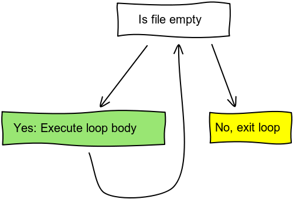
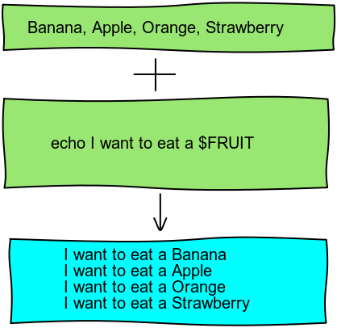

# Bash Scripts

## Agenda
* Hello Bash Scripts
* Exit Status
* Using Variables
* Loops and Branches
* Shell Builtins
* Arithmetics
* Functions
* Arrays

## Shell Programming
* Like any programming language
* Small bash programs automate daily tasks
* A bash program is just an executable text file

## A First Script
* Write the following into a file named hello
* Add execute permissions with `chmod +x hello`

<pre><code class="bash">
  #!/usr/bin/env bash

  echo All Your Base Are Belong To Us
</code></pre>
* Run it with ./hello

## Script Parameters
* Every script takes arguments from the command line
* Argument parsing happens automatically by bash
* Inside the script, parameters are named $1, $2, $3, ...
* Note $10 doesn't work. You'll need to ${10}
* Parameters count is saved in $#
* Access all parameters as one long list with `$*`
* Access all parameters as quoted items in a list with `$@`

## Script Parameters
* Save in file arguments
<pre><code class="bash">
  #!/usr/bin/env bash

  echo Got $# arguments
  echo script name is: $0
  echo first argument is: "<$1>"
</code></pre>

* run with ./arguments hello

## Script Parameters
<pre><code class="bash">
  #!/usr/bin/env bash

  mkdir $1
  touch $1/$(date "+%y%m%d%H%M")
</code></pre>

## Reading Input From User
* `read` command stops the script and reads a line of input from the
  user
* It takes one or more variable names as parameters
* Optional: -p to prompt

## Reading Input From User
<pre><code class="bash">
  read -p "Who Are You ?" NAME
  echo "Hello, $NAME"

  read -p "Who are you ?" FIRST LAST
  echo "Hello, Mr. $LAST."
</code></pre>

## `$*` vs. `$@`
* Consider the following script
<pre><code class="bash"> 
    touch $* 
</code></pre>

* Now run it with the following
<pre><code class="bash"> $ ./myscript foo bar buz </code></pre>

* Result: 3 files were created

## `$*` vs. `$@`
* Consider the following script
<pre><code class="bash">
    touch $* 
</code></pre>

* Now run it with the following
<pre><code class="bash"> $ ./myscript "foo bar buz" </code></pre>

* Result: 3 files were created. Can you explain why ?

## `$*` vs. `$@`
* Now let's fix the script
<pre><code class="bash">
    touch "$*"
</code></pre>

* Now run it with the following
<pre><code class="bash"> $ ./myscript "foo bar buz" </code></pre>

* Result: 1 file was created.

## `$*` vs. `$@`
* Now let's fix the script
<pre><code class="bash"> 
    touch "$*"
</code></pre>

* Now run it with the following
<pre><code class="bash"> $ ./myscript "foo" "bar" "buz" </code></pre>

* Result: 1 file was created. Can you explain why ?

## `$*` vs. `$@`
* Now let's fix the script
<pre><code class="bash">
    touch "$@"
</code></pre>

* Now run it with the following
<pre><code class="bash"> $ ./myscript "foo" "bar" "buz" </code></pre>

* Result: 3 files were created.

## `$*` vs. `$@`
* Different only when appear in double quotes
* `$*` expands to one word
* `$@` expands to multiple quoted words

  <h1>Q &amp; A</h1>
  
  <ul>
    <li class="done">Hello Bash Scripts</li>
    <li>Exit Status</li>
    <li>Using Variables</li>
    <li>If And Case
    <li>Loops</li>
    <li>Shell Builtins</li>
    <li>Arithmetics</li>
    <li>Functions</li>
    <li>Arrays</li>
  </ul>

# Bash As A Language

* Using Variables
* Making Decisions (if and case)
* Looping (while and for)

## Script Variables
* No need to predefine
* String by default
* Assign value with:
<pre><code class="bash">var=value</code></pre>
* NO SPACE AROUND `=`

## Script Variables
<pre><code class="bash">
  COUNT=5
  NAME=Ynon
  SONG_LINE="99 bottles of beer on the wall"
  TEXT='Can I borrow $5 ?'
</code></pre>

* No space around `=`
* Variable names are usually uppercased
* Quote when needed

## Using Variables
<pre><code class="bash">
  echo $COUNT
  echo $NAME     $COUNT
  cowsay $SONG_LINE
</code></pre>
* Using a variable requires the $

# Making Decisions

## Why Is Bash Different
* A shell executes other commands
* A decision is based on the success status of an executed command
* We don't care if it's true or false
* We need to knwo IF IT WORKED

## Did It Work ?
* Each program has an exit status that indicates its success
* A value of 0 means success
* Anything else is failure
* The value of the last executed process is saved in $?

## Setting Exit Value
* A script can set its exit status with the `exit` keyword
<pre><code class="bash">#!/usr/bin/env bash

echo Goodbye cruel world

# sets exit status of 7
exit 7
</code></pre>

## Unix Exit Status
<pre><code class="bash">
  $ grep foo nosuchfile
  grep: nosuchfile: No such file or directory

  $ echo $?
  2

  $ grep foo /etc/passwd
  $ echo $?
  1
</code></pre>

# Time To Decide

## Bash If
<pre><code class="bash">
  if grep user /etc/passwd
    then
      cowsay "Found You..."
    else
      echo "Sorry, not there"
  fi
</code></pre>

* If takes a command, not a condition
* Then is executed if command succeeds ($? == 0)
* Else is optional
* End with `fi`

## More Conditionals
* Double bracket is a special command that executes tests
* Available tests:
  * File tests
  * Numeric tests
  * String tests

## File Tests
<pre><code class="bash">
  if [[ -e /etc/passwd ]]; then
    echo "Password file exists as a path"

  if [[ -d /etc ]]; then
    echo "/etc directory is a directory"

  if [[ -s /tmp/test ]]; then
    echo "/tmp/test is a non-empty file"

  if [[ -r /etc/group ]]; then
    echo "/etc/group is readable"
</code></pre>

## Combining File Tests
<pre><code class="bash">
  if [[ -d /etc && -r /etc/passwd ]]; then
    echo "/etc is a directory AND /etc/passwd is readable"

  if [[ ! -s /tmp/test ]]; then
    echo "/tmp/test is an empty file"
</code></pre>

* Combine the tests with `&&`, `||` and `!`
* RTFM for the full list of file tests

## Numeric Tests
<pre><code class="bash">
  ZOMBIES=200
  HUMANS=50

  if [[ $ZOMBIES -gt $HUMANS ]]; then
    echo "It's a zombie apocalipse, run for your lives"

  if [[ 5 -lt 2 ]]; then
    echo "Math's not working, Oh my..."

</code></pre>

* Available numeric operators:
  * -eq, -ne, -lt, -le, -gt, -ge
  * arguments are positive/negative integers

## String Tests
<pre><code class="bash">
    if [[ -z $NAME ]]; then
      echo "NAME is an empty string"

    if [[ $NAME == "Ynon" ]]; then
      echo "Strings are equal"

    if [[ "foo" > "bar" ]]; then
      echo "foo sorts after bar"

    if [[ "hello" == h* ]]; then
      echo "hello starts with an h"
</code></pre>

## Bash Case
* Bash has a special switch-case block
* It's based on string match to wildcards
* Useful for handling different file types differently

## Bash Case
<pre><code class="bash">
    case $1 in
      *.png) echo "It's a png image";;
      *.txt) cat $1;;
      *.mp3) echo "Cool music";;
    esac
</code></pre>

  <h1>Q &amp; A</h1>
  
  <ul>
    <li class="done">Hello Bash Scripts</li>
    <li class="done">Exit Status</li>
    <li class="done">Using Variables</li>
    <li class="done">If and Case</li>
    <li>Loops</li>
    <li>Shell Builtins</li>
    <li>Arithmetics</li>
    <li>Functions</li>
    <li>Arrays</li>
  </ul>

# Bash Loops
* While loops
* For loops

## Let's Start With While

* While executes a command and checks its result
* If it succeeded:
  * The while block is executed
  * The command is executed and evaluated again

## While In Bash
<pre><code class="bash">
  while who | grep jimmy &> /dev/null
  do
      sleep 5
  done

  echo "Bye bye jimmy"
</code></pre>

## While In Bash
* Execute a command, check its exit status
* Can use [[ ... ]] to run tests
* Can use ! to invert exit status
* Can combine while with `read`

## While In Bash
<pre><code class="bash">
  read -p "What is the password ?" PASSWORD
  while [[ $PASSWORD != "shhh" ]]; do
    read -p "Wrong! Try again: " PASSWORD
  done
  
  echo "Welcome, Master"
</code></pre>

## For Loops

* For loops run a block of code for each item in a list

## Bash For
<pre><code class="bash">
  FRUITS="Apple Banana Orange Strawberry"

  for ITEM in $FRUITS
  do
    echo I want to eat an $ITEM
  done

</code></pre>

## Bash For
* Iterate over files matching a wildcard
* Iterate over command line arguments
* Looping with a count

## Iterate Over Files By Wildcard
<pre><code class="bash">
    for TXTFILE in *.txt
    do
      cp $TXTFILE ${TXTFILE}.bak
    done
</code></pre>

## Iterate Over Positionals
<pre><code class="bash">
  for ARGUMENT
  do
    echo "Got: $ARGUMENT"
  done
</code></pre>

## Looping with a count
<pre><code class="bash">
  for (( i=0; i < 10; i+=2 )); do
    echo "Counting: $i"
  done
</code></pre>

  <h1>Q &amp; A</h1>
  
  <ul>
    <li class="done">Hello Bash Scripts</li>
    <li class="done">Exit Status</li>
    <li class="done">Using Variables</li>
    <li class="done">If and Case</li>
    <li class="done">Loops</li>
    <li>Shell Builtins</li>
    <li>Arithmetics</li>
    <li>Functions</li>
    <li>Arrays</li>
  </ul>

# Shell Builtin Operations
* Variable Substitution
* printf
* pushd, popd

## Variable Substitution
* Remove prefix or suffix from variables
* Replace part of the variable

<pre><code class="bash">
    $ FILENAME=song.mp3

    $ echo ${FILENAME%.mp3}
    song

    $ echo ${FILENAME#*.}
    mp3

    $ echo ${FILENAME/mp/MP}
    song.MP3

</code></pre>

## Formatted Printing
<pre><code class="bash">
  $ printf "0x%x\n" 27
  0x1b

  $ printf "%s at %s\n" $USER $(hostname)  
  ynonperek at Ynons-MacBook-Pro.local

</code></pre>
* Use `printf` to print formatted string
* Pass arguments separated by spaces
* RTFM For a full list of supported format characters

## Directory Traversal
<pre><code class="bash">
  pushd /etc
  pushd /tmp
  
  # back to /etc
  popd
  
  # back to starting point
  popd
</code></pre>

# Shell Arithmetics
* Arithmetics in the shell is easy
* Use (( ... )) to perform numeric operations
* No need for $ inside the parens
* All C operators are supported

# Shell Arithmetics
<pre><code class="bash">
    $ (( x = 5   ))  
    $ (( x += 27 ))
    $ (( x *= 2  ))
   
    $ echo $x
    64
</code></pre>

## Combining Arithmetics With Scripting
* Count the number of text files with more than 10 lines
<pre class="fragment"><code class="bash">
    #!/usr/bin/env bash

    for FILENAME in *.txt
    do
      LINES=$(wc -l $FILENAME| tr -s ' ' | cut -d ' ' -f 2)
      if [[ $LINES -gt 10 ]]; then
        (( counter += 1 ))
      fi
    done

    echo "Found $counter files"
      
</code></pre>

  <h1>Q &amp; A</h1>
  
  <ul>
    <li class="done">Hello Bash Scripts</li>
    <li class="done">Exit Status</li>
    <li class="done">Using Variables</li>
    <li class="done">If and Case</li>
    <li class="done">Loops</li>
    <li class="done">Shell Builtins</li>
    <li class="done">Arithmetics</li>
    <li>Functions</li>
    <li>Arrays</li>
  </ul>

# Bash Functions
* Defining Functions
* Calling Functions
* Writing Functions in a Separate File

## Definine Functions
* Use the keyword `function` to create a function
* Takes only function body
* Arguments are positional parameters ($1, $2, ...)
* Argument count is stored in $#

## Defining Functions
<pre><code class="bash">
  #!/usr/bin/env bash

  function mk_and_cd
  {
    mkdir $1
    cd $1
  }

  mk_and_cd testdir
  touch testfile
</code></pre>

## Calling Functions
* Use function name to call a function
* Pass arguments as words
* Just like using functions from command line

## Externalizing Functions
* Simply running an external file as a shell script doesn't work
* It creates the functions in a new process, then exits and everything
  is lost
* Use `.` to load an external file from within the same shell

## Using External Functions
<pre><code class="bash">
  . utils.sh

  mk_and_cd testdir

</code></pre>

* utils.sh contains definitions for some utility functions
* Use it with `.`
* Then use functions from it

## Function Return Values
* A function can return a value with the `return` keyword
* The return value is stored in $?
* Works like running a "mini-script"

## Using Return Values
<pre><code class="bash">
  function add() {
    local result
    (( result = $1 + $2 ))
    return $result
  }

  add 10 20

  # prints 30
  echo $?
</code></pre>

  <h1>Q &amp; A</h1>
  
  <ul>
    <li class="done">Hello Bash Scripts</li>
    <li class="done">Exit Status</li>
    <li class="done">Using Variables</li>
    <li class="done">If and Case</li>
    <li class="done">Loops</li>
    <li class="done">Shell Builtins</li>
    <li class="done">Arithmetics</li>
    <li class="done">Functions</li>
    <li>Arrays</li>
  </ul>

## Bash Arrays
* Bash provides one dimensional arrays
* Unlimited in size
* Indexed using zero-based integers
* Allow keeping multiple values together

## Declaring Arrays

<pre><code class="bash">
  # Declare using assignment
  FILES=(/etc/group /etc/hosts /etc/passwd)
 
  # Assign elements one-by-one
  NAMES[0]="Captain Kirk"
  NAMES[1]="Spock"
  NAMES[2]="Bones"

</code></pre>

* You can also use `declare -a VAR` to declare it as an array

## Using Arrays
<pre><code class="bash">
  # print Spock
  echo ${NAMES[1]}

  # print Captain Kirk[0]
  echo $NAMES[1]
  
</code></pre>

* Accessing the array name returns the first element
* Use curlies AND brackets to access array elements

## Array Length
<pre><code class="bash">
    # prints 12
    echo ${#NAMES[0]}

    # prints 12
    echo ${#NAMES}

    # prints 3
    echo ${#NAMES[*]} 
</code></pre>

* Use `${#ARRAY[index]}` to get the length of the item at index
* Use `${#ARRAY[*]}` to get the items count in the array

  <h1>Q &amp; A</h1>
  
  <ul>
    <li class="done">Hello Bash Scripts</li>
    <li class="done">Exit Status</li>
    <li class="done">Using Variables</li>
    <li class="done">If and Case</li>
    <li class="done">Loops</li>
    <li class="done">Shell Builtins</li>
    <li class="done">Arithmetics</li>
    <li class="done">Functions</li>
    <li class="done">Arrays</li>
  </ul>

